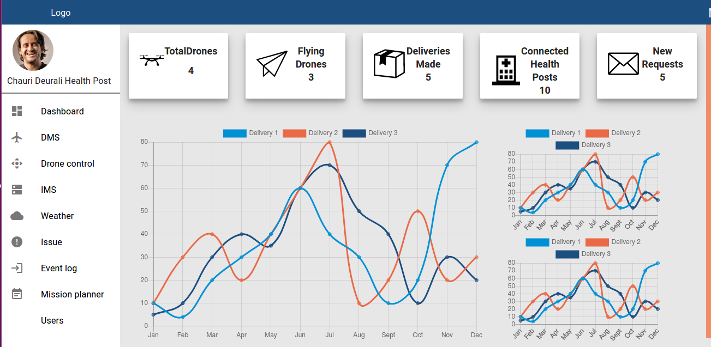

#### Drone Monitoring and Management System
<a href="https://prokuranepal.github.io/inventory_app/">Vuepress Doc</a>

Drone Monitoring and Management System is a cloud based web application for managing and monitoring the drone network. This application is based on React and Redux. This application is a control panel for admins in central distribution center to manage the drones, their issues, the users, the inventory of medicines in the central distribution center, event logs, weather etc and monitor their location and sensor status in real time.
We can also observer real time data of deliveries with their graphical representation.

#### Dashboard 

